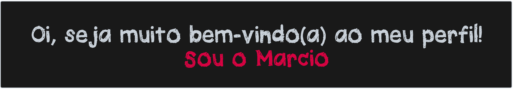

             

- Projetos que fiz: [Fashion](https://website-fashion.netlify.app)

- Algumas das minhas criações: [behance.net/marchm](https://www.behance.net/marchm)

<h3 align="left">Contatos:</h3> 

 
jason29@outlook.com.br 

<h3 align="left">Linguas e ferramentas que tenho experiência:</h3>

         

<h3 align="right">Atualmente estudo Javascript </h3>

 
 

